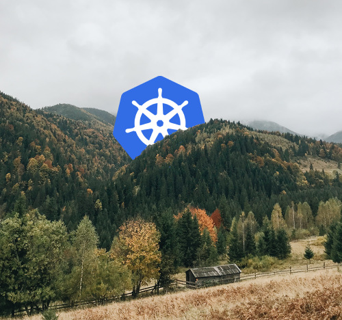

# Kube Karp - Easy Kubernetes HA using CARP

Add a floating virtual IP to Kubernetes cluster nodes for load balancing easily.



_Carpathian Mountains by [Victoria Skrypnik](https://unsplash.com/photos/uqirkWaeH0g)_

## Assign a shared virtual IP to Kubernetes nodes

Kube Karp allows Kubernetes cluster nodes to share a common virtual IP address in order to provide automatic Kube API Server failover. In beneath, it is using [UCarp](https://github.com/lorf/UCarp) which is a portable userland implementation of the secure and patent-free Common Address Redundancy Protocol (CARP, OpenBSD's alternative to the patents-bloated VRRP).

Kube Karp is running as a `DaemonSet` in the cluster which means it is deployed on every node. Hovewer, the image is built on Alpine Linux, it is about 3 MBs in size and requires about the same amount of memory on each node, so it will not be a resource hog :) It requires host network access and `NET_ADMIN` capabilities to manage the nodes' interface settings to add or remove the virtual IP of the current UCarp leader process. All nodes must be in the same subnet (configurable).

Practical use-case: in your `kubeconfig` file, the Kubernetes API Server URL can point to the virtual IP, so your cluster is always accessible, not depending on a particluar node's IP address. When the leader node becomes unavailable, another node takes the floating IP in about 3 seconds, so you can always reference the k8s cluster by the same virtual IP. The current leader is elected based on the CARP implementation.

Kube Karp can be deployed to an existing cluster, no need to tear it down then build it up from scratch. It should not require any maintenance, once you set it up, it just works™.

## Deploy Kube Karp with Helm

Install [Helm v3](https://github.com/helm/helm) on your machine, then run:

```bash
git clone https://github.com/immanuelfodor/kube-karp
cd kube-karp/helm

# now edit the values.yaml file to set up your preferences
# and then install Kube Karp with preferences from the file
helm install kube-karp .

# or install using the --set key=value flags,
# the values are just examples
helm install kube-karp . \
    --set envVars.virtualIp=192.168.100.100 \
    --set envVars.interface=enp0s3

# if you want to install it in a new kube-karp namespace, add
# the following flags to any of the above helm install commands
-n kube-karp --create-namespace

# you can check what will be installed with the template command
# beforehand, but do not forget to also add all your custom flags
helm template kube-karp .
```

## Access your Kubernetes cluster with the virtual IP

Replace your current node-IP in your `kubeconfig` file (possibly located at `~/.kube/config`) with the `KARP_VIRTUAL_IP` (`envVars.virtualIp` in the Helm chart). For example, your new config should be:

```yaml
apiVersion: v1
clusters:
- cluster:
    ...
    server: https://192.168.100.100:6443
    ...
```

**Attention!** Changing the IP will possibly result in losing access to your cluster temporarily without adding the insecure flag to further `kubectl` commands:

```bash
# this will not work
kubectl get nodes
# Unable to connect to the server: x509: certificate is valid for
# 192.168.100.110, 192.168.100.111, 192.168.100.112, 127.0.0.1, 10.43.0.1, not 192.168.100.100

# quick and dirty solution to get around it
kubectl get nodes --insecure-skip-tls-verify=true
# NAME        STATUS   ROLES                      AGE    VERSION
# ...
```

To permanently fix this, you need to add the `KARP_VIRTUAL_IP` (`envVars.virtualIp` in the Helm chart) to the Kube API Server certificate as a new SAN (Subject Alternative Name). If you have an RKE cluster, make the following change to to your `cluster.yml`:

```diff
 authentication:
   strategy: x509
-  sans: []
+  sans:
+  - "192.168.100.100"
   webhook: null
```

Then reconfigure the cluster and check the new IP in the Kube API Server certificate, the `kubectl` commands should work fine from now on:

```bash
# propagate the change to the cluster
rke up

# check the presence of the virtual IP in the API server cert
openssl s_client -connect 192.168.100.100:6443 | openssl x509 -noout -text

# kubectl commands should work fine from now on
kubectl get nodes
```

One caveat that will probably be solved by RKE maintainers in the future is that you will need to manually update the `kubeconfig` file with the floating virtual IP after any further `rke up` command issued. There is an open issue to fix this problem at [RKE #1682](https://github.com/rancher/rke/issues/1682).

Should you have a cluster bootstrapped with `kubeadm`, you can find some reading material here as a start but I use RKE, so this method is untested by me:
- A tutorial how to add a new SAN with `kubeadm`: https://blog.scottlowe.org/2019/07/30/adding-a-name-to-kubernetes-api-server-certificate/
- A related Github issue with more `certSANs` examples: https://github.com/kubernetes/kubeadm/issues/1447
- A tl;dr of the above: https://github.com/kubernetes/kubernetes/issues/76357

## How does Kube Karp compare to other tools?

Kube Karp does not provide `LoadBalancer` resources for exposed services, it only manages a virtual IP accross nodes in the same subnet.

However, its unique feature is that it can load balance the Kube API Server as well which other LB solutions can not do at the time of writing. See the following open issues for the circular dependency problem in [Porter #125](https://github.com/kubesphere/porter/issues/125), [MetalLB #168](https://github.com/metallb/metallb/issues/168) and [Kube-vip #76](https://github.com/plunder-app/kube-vip/issues/76) repositories.

You could also use Keepalived with HAProxy as mentioned in the official [k8s HA docs](https://github.com/kubernetes/kubeadm/blob/master/docs/ha-considerations.md) but you would also need to manually edit things on the nodes and then do the `kubeadm init` bootstrapping afterwards, which is not feasible if you already have a running cluster and you have even set it up with another cluster bootstrapping method (e.g., RKE).

The main motivation behind this project was to create an in-cluster solution without separate configs on each node and keep the Unix-philosophy of achieving only one thing with the tool. If you still need `LoadBalancer` resources in your cluster, go for the previously mentioned tools, I think these can co-exist besides Kube Karp but this scenario is untested.

## Disclaimer

I do not take responsibility for anything regarding the use or misuse of the contents of this repository. Please use it on your own risk.

## Contact

Immánuel Fodor  
[fodor.it](https://fodor.it/kubekarpit) | [Linkedin](https://fodor.it/kubekarpin)
